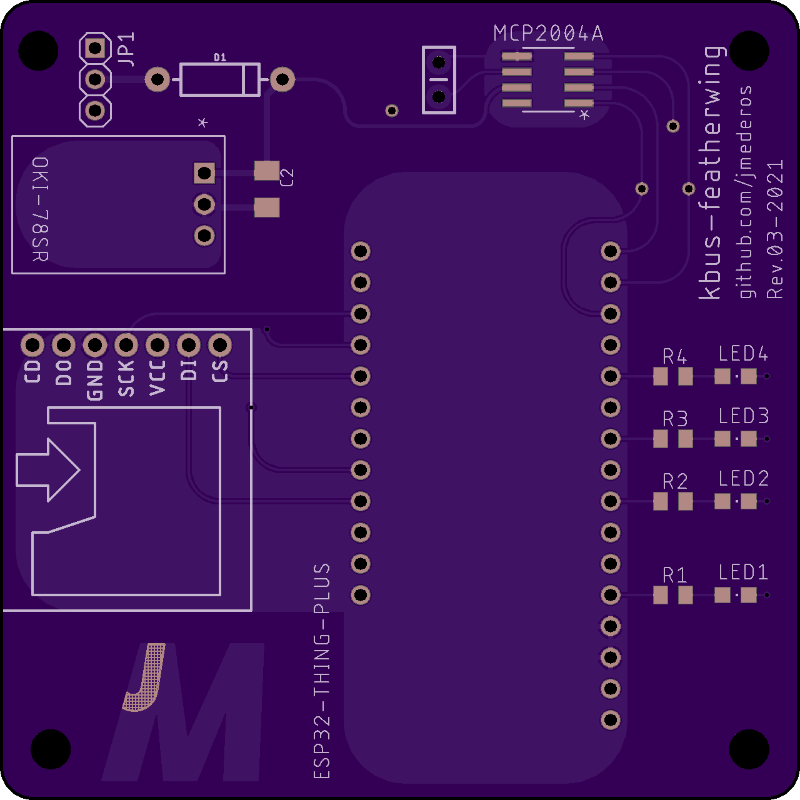
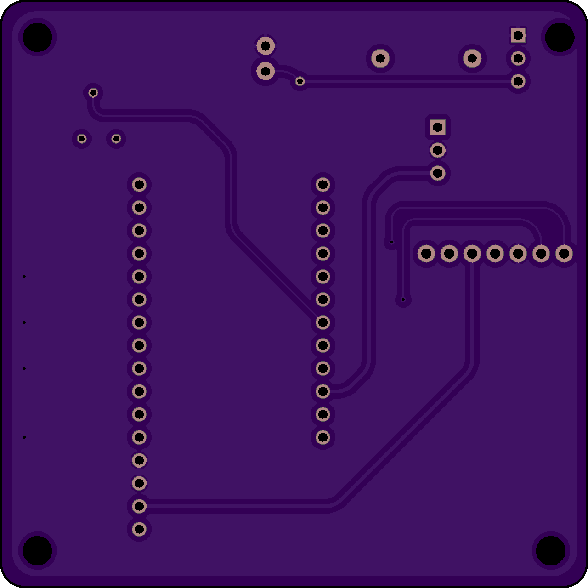
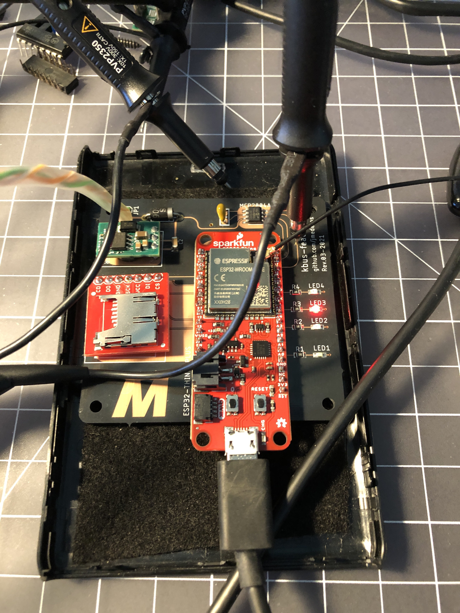

# Hardware

## Microcontroller
* [Sparkfun MicroMod ESP32](https://www.sparkfun.com/products/16781)
* [Sparkfun MicroMod ATP Board](https://www.sparkfun.com/products/16885)

## Power Regulation
| Part | Notes |
| --- | --- |
| ~~[On Semi NCV7805BTG 5V Regulator](https://www.digikey.com/en/products/detail/on-semiconductor/921437)~~ | Too inefficient
| [USB Power Supply](https://www.amazon.com/gp/product/B07KWRH61D) | Worked well for prototyping w/MicroMod ESP32
| [OKI-78SR-5](https://www.digikey.com/en/products/detail/OKI-78SR-5-1-5-W36H-C/3438675) | For v1 of feather board

## Transciever ICs
| Part | Status | Notes |
| --- | --- | --- |
| [ON Semi NCV7428D13R2G](https://www.digikey.com/en/products/detail/on-semiconductor/5022588) | 🤷🏽‍♂️ | Have it; still untested. |
| [NXP TJA1021T](https://www.digikey.com/en/products/detail/nxp-usa-inc/2034448) | 👍🏽 | Using with a `CP2102` USB ⇄ Serial to interface with NavCoder and simulate bus on desktop. |
| [TI SN65HVDA195QDRQ1](https://www.digikey.com/en/products/detail/texas-instruments/2094636) | 👎🏽 | Used on initial in-car perfboard prototypes. Works ok, but susceptible to glitching the bus (doors randomly unlocked); doesn't have tx timeout or contention detection. Best used to create a simulated bus as the controlling node like the `NXP` part above. |
| [Microchip MCP2025](https://www.digikey.com/en/products/detail/microchip-technology/3543134) | 🤷🏽‍♂️ | Have it; unlikely to test/use it. Doesn't have failsafe features and isn't pin-compatible w/`TI` |
| [Microchip MCP2004(A)](https://www.digikey.com/en/products/detail/MCP2004AT-E-SN/2803651) | 👍🏽 | Selected for tx timeout and bus contention detection + added bonus of `FAULT` pin. Also pin compatible with `TI` and `NXP` parts used for prototyping. So far, only tested `MCP2004A`; works in simulated bus setup. |
| [Microchip MCP2003B](https://www.digikey.com/en/products/detail/this-gets-ignored-🤷🏽‍♂️/5810590) | 🤷🏽‍♂️ | Selected for tx timeout and bus contention detection. Also pin compatible with `TI` and `NXP` parts used for prototyping. Have it; still untested. |

## Connector
The CD Changer connectors are a 3-pin power/data (all populated) and 6-pin audio (3 or 4 populated)
| Part | Notes |
| --- | --- |
| [TE AMP 1-1718346-1](https://www.newark.com/these/doNot/matter/dp/86Y2196) | Existing pre-wiring connector supplying `gnd`, `12v`, `kbus` |
| [TE AMP 1-968700-1](https://www.newark.com/these/doNot/matter/dp/86Y4923) | Matching socket for above; a row of 3 pin headers can also be used if this can't be sourced. OEM part [BMW 61 13 6 931 929](https://www.ecstuning.com/b-genuine-bmw-parts/pin-terminal/61136931929/) is order of magnitude more expensive. |
| [TE AMP 1379118-1](https://www.newark.com/these/doNot/matter/dp/69AH9772) | Matching socket for 6-pin audio connector. Depending on vehicle either 3 pin unbalanced audio or 4 pin balanced audio. |

## Board
Created a simple board for a more permanent installation

### BOM
_TODO_

### Pictures

  
  

